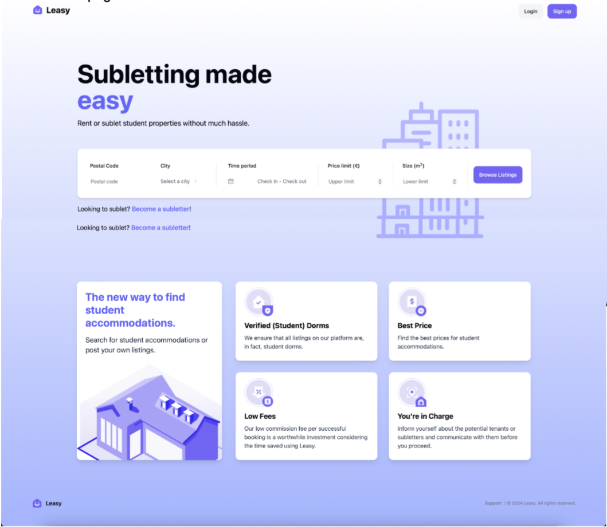
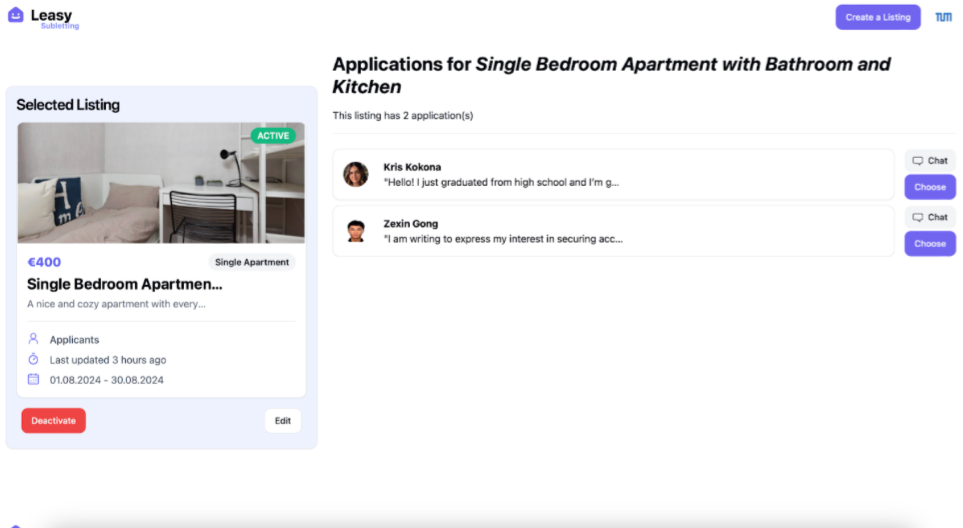
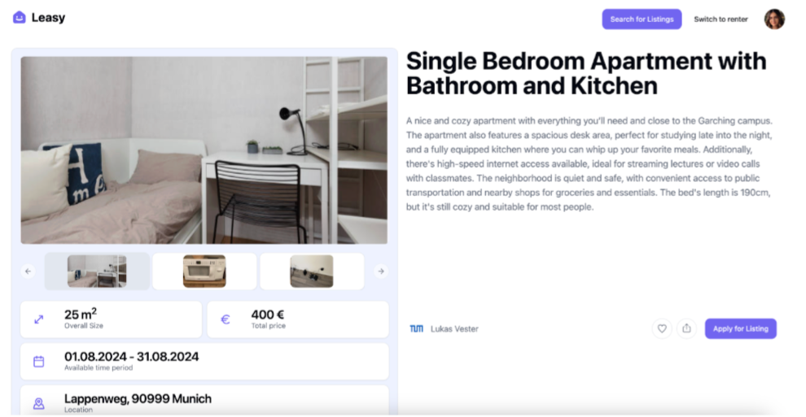
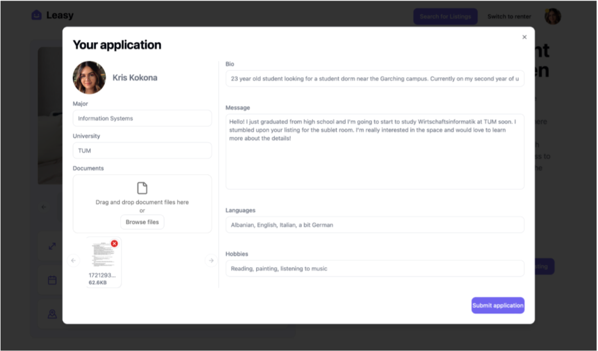

# 🏘️ Leasy - Subletting made easy 👨‍🎓

## ✍️ Description

Leasy is a platform that connects students who are looking for a place to stay with fellow students who have a place to rent. It is a platform that makes it easy to find, manage, apply, and rent sublets.

## 📺 Visuals

Homepage



Selecting tenants



Viewing listing



Application



## ⚙️ Setup

### ❗️ Prerequisites

- [Docker](https://www.docker.com/get-started) installed on your machine and running
- [Docker Compose](https://docs.docker.com/compose/install/) installed

### 🤔 Setup Instructions

1. **Make sure Docker is running** on your machine.
2. **Navigate to the root directory** of the project (if you are not already there)

3. **Build and run the application** using Docker Compose:

   ```bash
   docker-compose up --build
   ```

   The command above will build the Docker images for the backend and frontend, create and start the MongoDB container, and run all services.

4. **Access the application**:
   - **Backend:** API calls can be made via `http://localhost:8080`
   - **Frontend:** Open your browser and go to `http://localhost:5173`

### 🧹 Stopping and Cleaning Up

1. **Stop the application** by pressing `Ctrl + C` in the terminal where `docker-compose up` is running.

2. **Remove containers and volumes**:

   ```bash
   docker-compose down -v
   ```

   This stops and removes all containers, networks, and volumes created by `docker-compose up` based on the `docker-compose.yml` file.

### 👩‍💻 Local Development

Alternatively, you can run the backend and frontend locally. To do so, follow the instructions below:

1. **Start the backend**:

   - Navigate to the `backend` directory: `cd backend`
   - Install dependencies: `npm install`
   - Start the backend: `npm run dev`

2. **Start the frontend**:
   - Navigate to the `frontend` directory: `cd frontend`
   - Install dependencies: `npm install`
   - Start the frontend: `npm run dev`

Both the backend and frontend will be running on identical ports as the Docker setup.

## 💻 Tech Stack

- **Backend:** The backend is a Node.js application using Express.js and MongoDB. Mongoose is used as the ODM for MongoDB.
- **Frontend:** The frontend is a React application created with Vite.js. We use [Tailwind CSS](https://tailwindcss.com/) for styling and the [shadcn/ui](https://ui.shadcn.com/) library as the basis of our UI components.
- **Database:** MongoDB is used as the database for the application.

## 👨‍💻🫡 Authors and Acknowledgment

This project was developed by Team 31 as part of the Software Engineering for Business Applications course at the Technical University of Munich. The team members are:
- Evan Christopher
- Kris Kokona
- Lukas Vester
- Zexin Gong

As a final note, we, team 31, would also like to thank Prof. Dr. Matthes and our instructors for their guidance, support, and feedback throughout the project. This project would not have been possible without their help.
